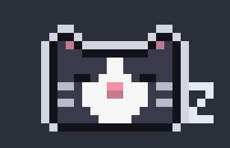
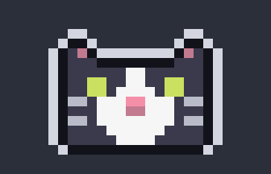
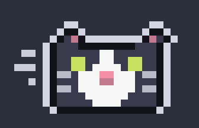
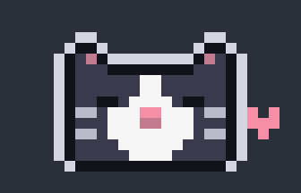
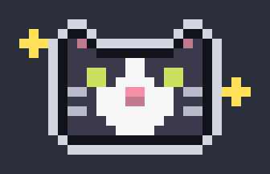

<p align="center">
  
</p>

<h1 align="center">TuxedoRun</h1>

<p align="center">
  A pixel tuxedo cat that lives in your Mac's menu bar.<br>
  It sleeps when your Mac is calm, runs when it's busy, and keeps your focus time with a built-in pomodoro timer.
</p>

<p align="center">
  
  
  
</p>

## Why a cat?

Your CPU load is boring to read as a number. A cat is not. Glance up and you know how hard your Mac is working: a sleeping cat means nothing is going on, and a sprinting cat means something is eating your cores. Then press Start and the same cat becomes your focus buddy.

It is a tiny native app: one menu bar icon, no windows, no Dock icon, and no dependencies.

## Three moods, one for each level of CPU load

| | CPU | What the cat does |
| --- | --- | --- |
|  | **under 33%** | **Sleeping.** Eyes shut, a little Z drifting up. |
|  | **33% to 70%** | **Waving ears.** Hops along and flops its ears, faster as the load climbs. |
|  | **over 70%** | **Running.** Ears pinned back, speed lines streaking behind, faster the harder your Mac works. |

The cat blinks now and then, and the reading is smoothed so it doesn't flicker between moods.

## Pomodoro, built in

Click the cat, choose **Start Focus**, and the countdown appears next to it in the menu bar.

| | When | What happens |
| --- | --- | --- |
|  | **Break** | The cat stops following CPU, shuts its eyes, and a heart floats up. You've earned it. |
|  | **Phase ends** | The cat cheers with sparkles, a notification pops up, and a sound plays. |

- **Classic cycle:** 25 minutes of focus, a 5-minute break, and a 15-minute long break after every 4th session. Presets for **50 / 10 / 30** and **15 / 3 / 10** are in the menu.
- **You stay in charge:** the next phase waits for you to click Start. Turn on **Auto-start Breaks** if you want breaks to begin on their own.
- **Pause, resume, skip, reset**, and a count of today's finished sessions.
- **Sleep-proof:** the timer works from an end time, so closing the lid or relaunching the app never throws it off. Your settings and a running timer are saved.
- **Quiet when you want it:** toggle notifications, sound, and the menu bar countdown separately.

## Install

You need macOS 13 or later and the Xcode command line tools (`xcode-select --install`).

```bash
git clone https://github.com/LuCaZrD/TuxedoRun.git
cd TuxedoRun
./build.sh
cp -R TuxedoRun.app /Applications/
open /Applications/TuxedoRun.app
```

Then open the cat's menu and turn on **Launch at Login** so it's always there.

Building it yourself means macOS has no reason to warn you about the app. There is no prebuilt download yet: the app isn't signed with an Apple Developer ID, so a downloaded copy would be blocked by Gatekeeper.

## Try a whole cycle in 30 seconds

```bash
/Applications/TuxedoRun.app/Contents/MacOS/TuxedoRun --fast
```

`--fast` shrinks every phase to a few seconds (10 s of focus, 4 s of break) and saves nothing. Quit the normal copy first so you don't end up with two cats.

## How it works

- **CPU:** read from the Mach `host_processor_info` call once a second, averaged over every core, and smoothed.
- **The cat:** a 16x12 pixel sprite drawn in code. Every frame (hop, ear flop, run lean, effects) is rendered from that one sprite, with a light rim so the dark fur reads on dark and light menu bars.
- **The timer:** a small state machine in `Pomodoro.swift` that uses only Foundation. It has its own checks you can run: `TuxedoRun --selftest` drives it through full cycles with a fake clock, including pause, skip, a long break, waking from a 10-hour sleep, a new day, and a relaunch.

```text
Cat.swift        the sprite, poses, and every animation frame
CPU.swift        the CPU meter
Pomodoro.swift   the timer state machine (Foundation only)
Selftest.swift   --selftest: checks the timer without a UI
main.swift       the menu bar app, menu, notifications, and animation loop
build.sh         builds and signs TuxedoRun.app
```

Two more flags help when you change the art: `--dump out.png` writes every frame to one sheet, and `--export docs` regenerates the GIFs in this README.

## Make it your own cat

The cat started as the `tuxedo` theme for [pixel-pet](https://github.com/Namenomeaning/pixel-pet), a pixel pet for the Claude Code terminal, and the theme is saved here as `tuxedo.theme.json`. To swap in a different pet, replace the `sprite` rows and `palette` colors at the top of `Cat.swift`, then rebuild.

## Credits

The tuxedo cat is original pixel art, drawn for pixel-pet and reused here. The idea owes a lot to [RunCat](https://kyome.io/runcat/), the menu bar app where a running animal shows your CPU.
